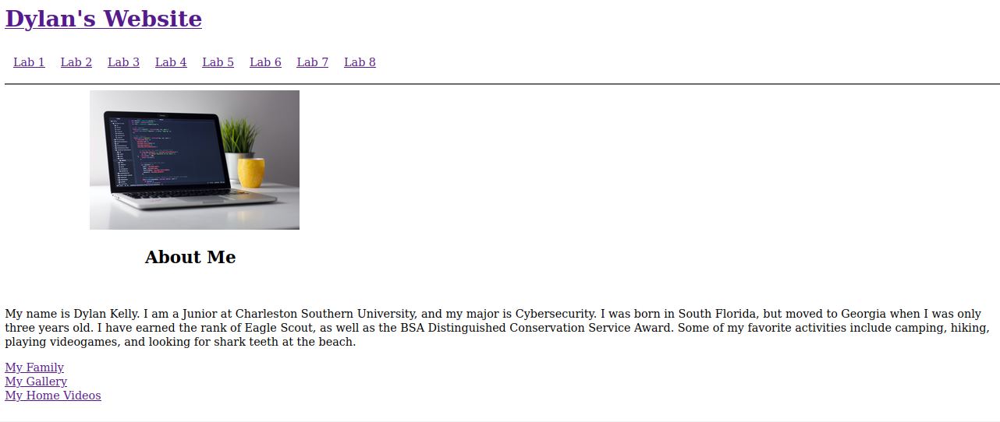
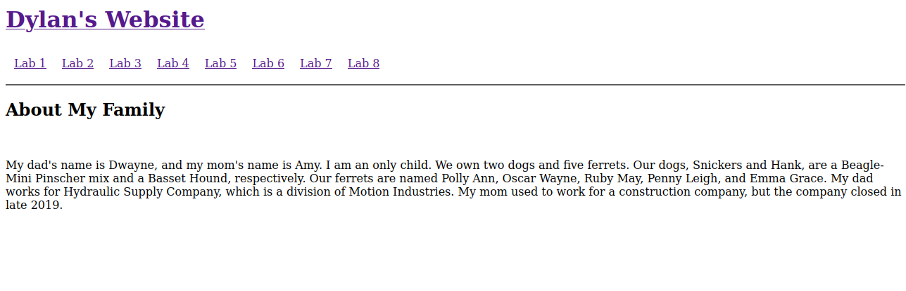
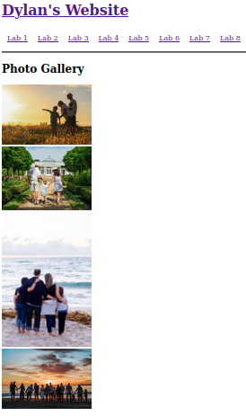
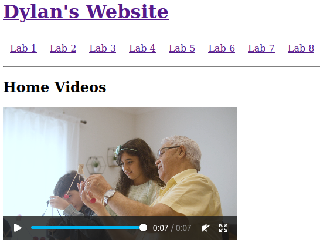

[Back to Portfolio](./)

Home Page Project
===============

-   **Class:** CSCI 332 Applied Networking
-   **Grade:** B 
-   **Language(s):** HTML
-   **Source Code Repository:** [CSCI332FinalProject](https://github.com/DylanAKelly/CSCI332FinalProject)
    (Please [email me](mailto:dakelly@csustudent.net?subject=GitHub%20Access) to request access.)

## Project description

The Home Page project was something we worked on for the entire duration of the course. For some of the labs, we were instructed to make a new page on our website with the title "Lab #" and complete the lab exercises on that page. We also were instructed to create a "My Family" page, a "My Gallery" page, and a "My Home Videos" page. 

## How to run the program

In order to run my Home Page, you will need the means to run a live server. For the class, we were instructed to use the Live Server extension on VSCode, made by Ritwick Dey. Once you have the ability to run the server, click on the "Releases" link to the right of the repository. Then, open your IDE and pen the "Home Page" folder. Once there, use the Live Server extension to begin the server and open your localhost on your computer. 

## UI Design

Almost every program requires user interaction, even command-line programs. Include in this section the tasks the user can complete and what the program does. You don't need to include how it works here; that information may go in the project description or in an additional section, depending on its significance.

The UI design is fairly crude. This is because the purpose of the website was for us to learn the basics of HTML. The Home Page functions as an About Me page (see Fig 1). The "My Family" contains some information about my family (see Fig 2). The "My Gallery" page has four images which I selected from a webiste (See Fig 3). Finally, the "My Home Videos" page plays a seven second video of a grandfather spending time with his grandchildren (see Fig 4).

  
Fig 1. The Home Page's home page and "About Me" section.

  
Fig 2. The "My Family" page.

  
Fig 3. The "My Gallery" page.

  
Fig 4. The "My Home Videos" page.

## 3. Additional Considerations

The Home Page project served to familiarize us with HTML and allowed us to create our very own (rudimentary) website.
[Back to Portfolio](./)
