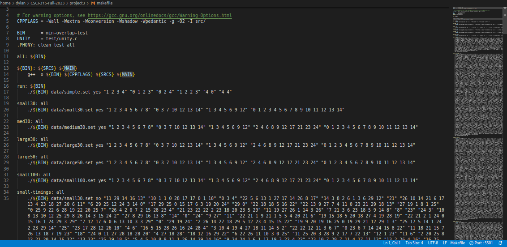

[Back to Portfolio](./)

Minimum Overlap Coverage
===============

-   **Class:** CSCI 315 Data Structures Analysis
-   **Grade:** C
-   **Language(s):** C++
-   **Source Code Repository:** [CSCI315Project](https://github.com/DylanAKelly/CSCI315Project)
  
    (Please [email me](mailto:example@csustudent.net?subject=GitHub%20Access) to request access.)

## Project description

The instructions for the project do a much better job at explaining what was required than I could ever hope to, so [here](https://github.com/DylanAKelly/CSCI315Project/blob/main/project3/project3.pdf) is a link to the instructions. 

## How to compile and run the program

First, download the project3 folder or click the "Release" link found on the right side of the repository and download that file. Then, open your terminal or command line interface and navigate to the pprject 3 folder. Type "make all" in the terminal/CLI and press "enter". Additionally, if you want to try other make commands, look at the makefile and pick one to run. 

## UI Design

There is not much UI to speak of with this program, outside of what it outputs to the terminal/CLI. When a make command is run, the program outputs the cover that was tested, the minimum number of overlaps with that cover, and the amout of time it took my program to calculate the minimum number of overlaps (see Fig 1). Additionally, the median time to find a cover is displayed. The makefile contains multiple different commands that can be used to test different covers of different sizes (see Fig 2). 

  
**Fig 1. Minimum Overlap Output**

  
**Fig 2. Makefile commands**

## 3. Additional Considerations

This was the third and final project for this course, so everything we had learned about the different data structures throughout the course was applied to this project. My grade for this project was a 70, which earned me a C. My grade was the result of my code working ( but being relatively slow) and other extraneous factors. 

[Back to Portfolio](./)
