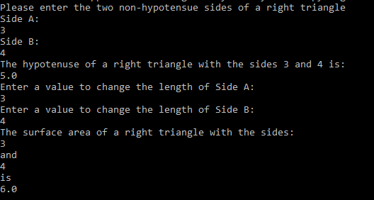

[Back to Portfolio](./)

Right Triangle Calculator
===============

-   **Class:** CSCI 301 Survey of Scripting Languages
-   **Grade:** A
-   **Language(s):** Python
-   **Source Code Repository:** [CSCI301Program](https://github.com/DylanAKelly/CSCI301Program)
    (Please [email me](mailto:dakelly@csustudent.net?subject=GitHub%20Access) to request access.)

## Project description

This program prompts the user for two two non-hypotenuse sides of a right triangle. The program has the user enter these values using the terminal/command line interface. Then the program calculates the length of the hypotenuse. Afterwards, the program prompts the user to change the values for the non-hypotenuse sides of the triangle. After the user enters two more values (which can be the same as the previous values) the program calculates the surface area of the triangle. 

## How to run the program

To run the program, ensure that you have Python installed on your computer. Then, download the RightTriangle.py file to your computer or click on the "releases" link to the right of the repository. Once the file has downloaded, open your terminal or Command Line Interface and navigate to where the file was downloaded. Finally, type the following into the terminal/CLI. 

```bash
py RightTriangle.py
```

## UI Design

The Right Triangle Calculator has a very basic design, simply being a command line program.

The Right Triangle Calculator allows a user to input two integer for the non-hypotenuse sides of a right triangle via the command line. The program then returns the length of the hypotenuse to the command line, and prompts the user to enter two more integers into the command line for the non-hypotenuse sides of another right triangle. Once the user inputs two more integers, the program returns the surface area of the triangle (see Fig 1).

  
**Fig 1. The Right Triangle Calculator**


## 3. Additional Considerations

The primary purpose of this program was to increase our familiarity with Python. 

[Back to Portfolio](./)
