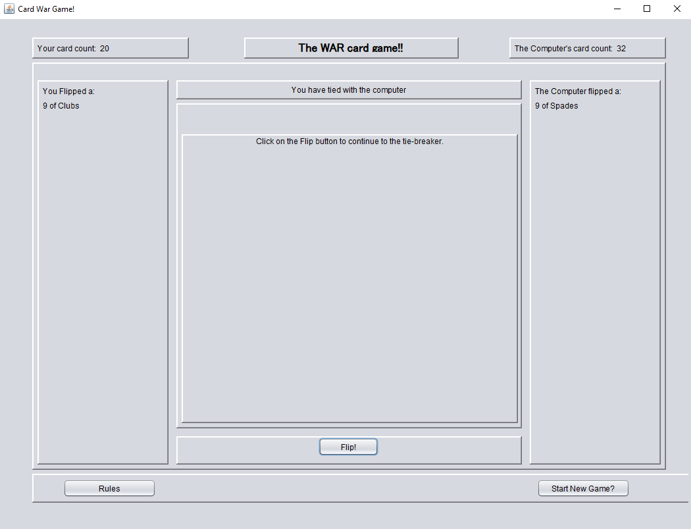

[Back to Portfolio](./)

War Game
===============

-   **Class:** CSCI 325 Object-Oriented Programming
-   **Grade:** B
-   **Language(s):** Java
-   **Source Code Repository:** [CSCI325WarGame](https://github.com/DylanAKelly/CSCI325WarGame)  
    (Please [email me](mailto:dakelly@csustudent.net?subject=GitHub%20Access) to request access.)

## Project description

As the title suggests, this program simulates the card game War. The program allows the user to play a game of War against a "computer". There is a "Rules" button that displays the rules for anyone not familiar with the game, a "Start New Game?" button, used to start a new game, and the "Flip!" button which triggers the next round of War. 

## How to compile and run the program

To compile an run this program, first download all files in the repository (and put them in one folder) or click the "Release" link located on the roght side of the repository and download the project folder. Once you have downloaded the files, make sure you have Java installed on your computer. Once Java is installed, open your terminal/CLI and navigate to the folder that contains the program files and type:

```bash
javac WarGameGUI.java
```
into the terminal. Then, type:
```bash
java WarGameGUI.java
```
into the terminal and hit enter. The War Game should now be running on your computer. 

## UI Design

The UI was a heavy focus of the project, as it allowed us to put what we learned in class to use. The UI had three buttons. The first was a "Rules" button that displayed the rules of War to the user (see Fig 1). The second was the "Start New Game?" button, which allowed the user to start the game of War. The third was the "Flip!" button, which triggered the next round of War when pressed (see Fig 2). Just like the physical card game, ties result in War! and force a tie-breaker. Each player puts 2 cards "face down", and then flip the 3rd at the same time. The larger-valued card would win the tie-breaker (see Figs 3 & 4).

  
**Fig 1. The Rules of the Game.**

  
**Fig 2. A simulated round.**

  
**Fig 3. A tie.**

  
**Fig 4. Tie-breaker results.**

## 3. Additional Considerations
This was the final project for the course, so everything we had learned in class was applied to the construction of this project. This was a group project. The UI for the game had color at one point, but no longer does. I have not succeeded in determining why the UI is now gray (Truly a shame, I preferred how it looked with color).

[Back to Portfolio](./)
