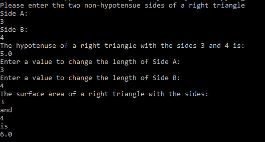

Portfolio
=========

Programming Projects
--------------------

*For access to my private project repositories, please [email me](mailto:dakelly@csustudent.net?subject=GitHub%20Access) with the subject line, GitHub Access.

---
### [Right Triangle Calculator | CSCI 301](RightTriangleCalc.md)

---
### [Minimum Overlap Coverage | CSCI 315](MinimumOverlapCoverage.md)

---
### [War Card Game | CSCI 325](WarGame.md)

---
### [Home Website | CSCI 332](HomePage.md)

---

Ethics Papers
-------------

### [Ethical Concerns in Computer Science](/pdf/CSCI315_Ethics_Paper.pdf)

-   **Class:**  CSCI 315 Data Structures Analysis
-   **Grade:** A

### [Ethics in Computer Science](/pdf/CSCI325_Ethics_Paper.pdf)

-   **Class:** CSCI 325 Object-Oriented Programing
-   **Grade:** A

### [Copyright, Fair Use, and Computer Science](/pdf/CSCI301_Ethics_Paper.pdf)

-   **Class:** CSCI 301 Survey of Scripting Languages
-   **Grade:** A

---

Presentations
-------------

### [The Story of Kevin Mitnick](/pdf/CSCI405_Presentation.pdf)

- **Class:** CSCI 405 Principles of Cybersecurity 
- **Grade:** A

### [ACLs and Firewalls](/pdf/CSCI352_Presentation.pdf)

- **Class:** CSCI 352 Cyber Defense
- **Grade:** A

---

Page template forked from <a href="https://github.com/csu-cs/csci-portfolio">CSU-CS</a>

<!-- Remove above link if you don't want to attributive -->
